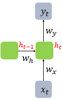

## RNN 행렬 형태 표현
RNN(순환 신경망)을 행렬 형태로 표현해보겠습니다. RNN의 특징은 이전 시점의 은닉 상태(hidden state)가 현재 계산에 영향을 준다는 점입니다.


*n차원 입력벡터, m 차원 은닉뉴런수, k 차원 출력뉴런수 2차원 뉴렬네트워크

입력:

- $x_t \in \mathbb{R}^n$ (t 시점의 n차원 입력 벡터)

은닉 상태:

- $h_{t-1} \in \mathbb{R}^m$ (이전 시점 t-1의 은닉 상태)
- $h_t \in \mathbb{R}^m$ (현재 시점 t의 은닉 상태)

가중치 행렬:

- $W_{xh} \in \mathbb{R}^{m \times n}$ (입력에서 은닉 상태로의 가중치)
- $W_{hh} \in \mathbb{R}^{m \times m}$ (이전 은닉 상태에서 현재 은닉 상태로의 가중치)
- $W_{hy} \in \mathbb{R}^{k \times m}$ (은닉 상태에서 출력으로의 가중치)

RNN의 수식:

1. 은닉 상태 계산: $h_t = \sigma(W_{xh} \cdot x_t + W_{hh} \cdot h_{t-1})$
2. 출력 계산: $y_t = W_{hy} \cdot h_t$

![[rnn_image2_ver3.png]]



## 간단한 RNN 예제
간단한 RNN 예제를 만들어서 순전파(forward propagation)와 역전파(backpropagation)를 계산해보겠습니다.

가장 단순한 형태의 RNN을 위해:
- 입력 차원(n) = 2
- 은닉 뉴런 수(m) = 3
- 출력 차원(k) = 1
- 시간 스텝 = 2
- 활성화 함수 = tanh

## 초기 가중치 설정
```
W_xh = [
    [0.1, 0.3],
    [0.2, 0.2],
    [0.3, 0.1]
]

W_hh = [
    [0.2, 0.2, 0.2],
    [0.1, 0.1, 0.1],
    [0.0, 0.1, 0.2]
]

W_hy = [
    [0.1, 0.2, 0.3]
]
```

## 입력 데이터
```
x_0 = [1, 2]
x_1 = [0, 1]
```

## 초기 은닉 상태
```
h_-1 = [0, 0, 0]
```

## 순전파 계산

**시간 t=0**:
```
h_0 = tanh(W_xh · x_0 + W_hh · h_-1)
    = tanh([0.1*1 + 0.3*2, 0.2*1 + 0.2*2, 0.3*1 + 0.1*2] + [0, 0, 0])
    = tanh([0.7, 0.6, 0.5])
    = [0.6043, 0.5370, 0.4621]

y_0 = W_hy · h_0
    = [0.1*0.6043 + 0.2*0.5370 + 0.3*0.4621]
    = [0.2648]
```

**시간 t=1**:
```
h_1 = tanh(W_xh · x_1 + W_hh · h_0)
    = tanh([0.1*0 + 0.3*1, 0.2*0 + 0.2*1, 0.3*0 + 0.1*1] 
           + [0.2*0.6043 + 0.2*0.5370 + 0.2*0.4621, 
              0.1*0.6043 + 0.1*0.5370 + 0.1*0.4621,
              0.0*0.6043 + 0.1*0.5370 + 0.2*0.4621])
    = tanh([0.3 + 0.3207, 0.2 + 0.1603, 0.1 + 0.1462])
    = tanh([0.6207, 0.3603, 0.2462])
    = [0.5518, 0.3454, 0.2402]

y_1 = W_hy · h_1
    = [0.1*0.5518 + 0.2*0.3454 + 0.3*0.2402]
    = [0.1813]
```

## 역전파 계산

간단하게 Mean Squared Error(MSE) 손실 함수를 사용하고, 실제 목표값을 t_0 = 0.5, t_1 = 0.7로 가정하겠습니다.

**손실 계산**:
```
L_0 = (y_0 - t_0)² = (0.2648 - 0.5)² = 0.0552
L_1 = (y_1 - t_1)² = (0.1813 - 0.7)² = 0.2688
L = L_0 + L_1 = 0.3240
```

**시간 t=1에서의 역전파**:
```
dL/dy_1 = 2 * (y_1 - t_1) = 2 * (0.1813 - 0.7) = -1.0374

dL/dW_hy = dL/dy_1 * h_1^T
         = [-1.0374] * [0.5518, 0.3454, 0.2402]
         = [-0.5725, -0.3583, -0.2492]

dL/dh_1 = W_hy^T * dL/dy_1
        = [[0.1], [0.2], [0.3]] * [-1.0374]
        = [-0.1037, -0.2075, -0.3112]

dL/da_1 = dL/dh_1 * (1 - tanh²(a_1))
        = [-0.1037, -0.2075, -0.3112] * [1-0.5518², 1-0.3454², 1-0.2402²]
        = [-0.1037, -0.2075, -0.3112] * [0.6955, 0.8807, 0.9423]
        = [-0.0721, -0.1827, -0.2932]
```

여기서 a_1은 tanh의 입력값(W_xh · x_1 + W_hh · h_0)입니다.

**시간 t=0에서의 역전파** (BPTT - Backpropagation Through Time):
```
dL/dy_0 = 2 * (y_0 - t_0) = 2 * (0.2648 - 0.5) = -0.4704

dL/dW_hy += dL/dy_0 * h_0^T
          = [-0.4704] * [0.6043, 0.5370, 0.4621]
          = [-0.2843, -0.2526, -0.2174]

총 dL/dW_hy = [-0.5725-0.2843, -0.3583-0.2526, -0.2492-0.2174]
            = [-0.8568, -0.6109, -0.4666]
```

나머지 가중치(W_xh, W_hh)에 대한 역전파도 비슷한 방식으로 계산할 수 있습니다만, 계산이 복잡해지므로 여기까지만 보여드리겠습니다.

실제 업데이트는 학습률(η)을 곱해 이루어집니다. 예를 들어 η=0.1이라면:
```
W_hy_new = W_hy - η * dL/dW_hy
         = [0.1, 0.2, 0.3] - 0.1 * [-0.8568, -0.6109, -0.4666]
         = [0.1857, 0.2611, 0.3467]
```

이것이 간단한 RNN의 순전파와 역전파 예입니다.


## RNN 의 계산 복잡도와 계산량
RNN과 DNN의 기본적인 순전파와 역전파 계산 메커니즘은 개념적으로 비슷하고 각 단계별로 보면 상대적으로 간단합니다. 둘 다 행렬 곱셈과 비선형 활성화 함수의 조합으로 이루어져 있으니까요.

RNN의 큰 차이점은 시간 차원이 추가되어 계산이 재귀적으로 이루어진다는 점입니다. 이로 인해 두 가지 주요 이슈가 발생합니다:

1. **계산량 증가**: 시퀀스 길이에 비례해서 계산량이 증가합니다. 특히 BPTT(Backpropagation Through Time)에서는 모든 시간 단계를 거슬러 올라가며 계산해야 하므로, 시퀀스가 길어질수록 계산량이 선형적으로 증가합니다.
    
2. **기울기 문제**: 더 심각한 문제는 장기 의존성(long-term dependency) 학습의 어려움입니다. 역전파 과정에서 시간을 거슬러 올라갈수록 기울기가 소실(vanishing)되거나 폭발(exploding)하는 경향이 있습니다. 이는 활성화 함수의 미분값(tanh의 경우 최대 1)이 연쇄적으로 곱해지기 때문입니다.
    

이런 문제들을 해결하기 위해 LSTM이나 GRU 같은 개선된 RNN 구조가 개발되었습니다. 이들은 기본 RNN보다 계산은 더 복잡하지만, 장기 의존성 문제를 효과적으로 완화합니다.

## RNN은 tanh, DNN 은 ReLU 를 선호하는 이유
RNN에서 tanh 활성화 함수를 주로 사용하는 이유는 몇 가지 중요한 특성 때문입니다:

1. **범위와 중심화**: tanh는 출력이 (-1, 1) 범위로 제한되고 평균이 0에 가깝습니다. 이런 중심화된 출력은 다음 시간 단계로 전달될 때 안정적인 학습에 도움이 됩니다. RNN은 이전 상태가 다음 계산에 직접 영향을 주기 때문에 이 특성이 중요합니다.
2. **기울기 정보**: tanh는 출력이 0 근처일 때 기울기 정보가 잘 보존됩니다. RNN에서는 시간을 거슬러 기울기를 전파할 때 이 특성이 유용합니다.
3. **경험적 결과**: 실험적으로 RNN에서는 tanh가 ReLU보다 더 나은 성능을 보이는 경우가 많았습니다.

반면, DNN에서 ReLU를 선호하는 이유는:

1. **계산 효율성**: ReLU는 계산이 단순하고 빠릅니다(음수를 0으로, 양수는 그대로).
2. **기울기 소실 완화**: 양수 영역에서 기울기가 항상 1이므로 깊은 네트워크에서도 기울기 소실 문제가 덜 발생합니다.
3. **희소 활성화**: ReLU는 많은 뉴런을 0으로 만들어 네트워크의 희소성을 증가시킵니다.

물론 LSTM이나 GRU 같은 현대적인 RNN 구조에서는 내부 게이트에 시그모이드와 tanh를 함께 사용하며, 최근 연구에서는 RNN에서도 ReLU를 사용하는 경우가 늘고 있습니다.


# tanh, sigmoid, ReLU 비교

## 기울기 소실 문제

- **Sigmoid**: 가장 심각한 기울기 소실 문제를 겪습니다. 출력 범위가 (0,1)이고 최대 미분값은 0.25로, 깊은 네트워크에서 여러 층을 거치면 기울기가 빠르게 0에 가까워집니다.
- **tanh**: Sigmoid보다는 나은 편이지만 여전히 기울기 소실 문제가 있습니다. 출력 범위는 (-1,1)이고 최대 미분값은 1입니다. 여러 층을 거치면 기울기가 감소합니다.
- **ReLU**: 양수 입력에 대해 기울기가 항상 1이므로 기울기 소실 문제가 크게 완화됩니다. 다만 음수 입력에서는 기울기가 0이 되는 "죽은 뉴런" 문제가 있습니다.

## 정보 전달 특성

- **Sigmoid**: 출력이 (0,1) 범위로 제한되어 확률값 표현에 유용하지만, 0과 1에 가까워지면 정보 변별력이 떨어집니다.
- **tanh**: 출력이 (-1,1)로 평균이 0에 가까워 다음 층으로의 정보 전달이 효과적입니다. 특히 순환 신경망에서 유용합니다.
- **ReLU**: 양수 값을 그대로 통과시켜 정보 손실이 적고, 희소 활성화(많은 뉴런이 0)로 효율적인 표현이 가능합니다.

## 계산 효율성

- **Sigmoid**: 지수 함수를 사용해 계산 비용이 높습니다.
- **tanh**: 마찬가지로 지수 함수를 사용해 계산 비용이 높습니다.
- **ReLU**: 단순 임계값 함수(max(0,x))로 계산이 매우 빠릅니다.

## 추가 특성 비교

- **포화 문제**: Sigmoid와 tanh는 큰 입력값에서 포화되어 학습이 느려질 수 있습니다. ReLU는 양수 영역에서 포화되지 않습니다.
- **정규화 효과**: ReLU의 희소 활성화는 자연스러운 정규화 효과를 제공합니다.
- **생물학적 유사성**: ReLU는 뇌의 뉴런 활성화와 더 유사한 특성을 가집니다.
- **변형 함수**: 각 함수는 단점을 보완하는 변형이 있습니다:
    - Leaky ReLU, Parametric ReLU: 죽은 뉴런 문제 해결
    - ELU, SELU: 음수 영역에서 부드러운 포화 제공
    - Swish: 약한 음수 값 허용으로 더 나은 성능

네트워크와 태스크에 따라 적합한 활성화 함수가 다르므로, 문제에 맞는 활성화 함수를 선택하는 것이 중요합니다.


